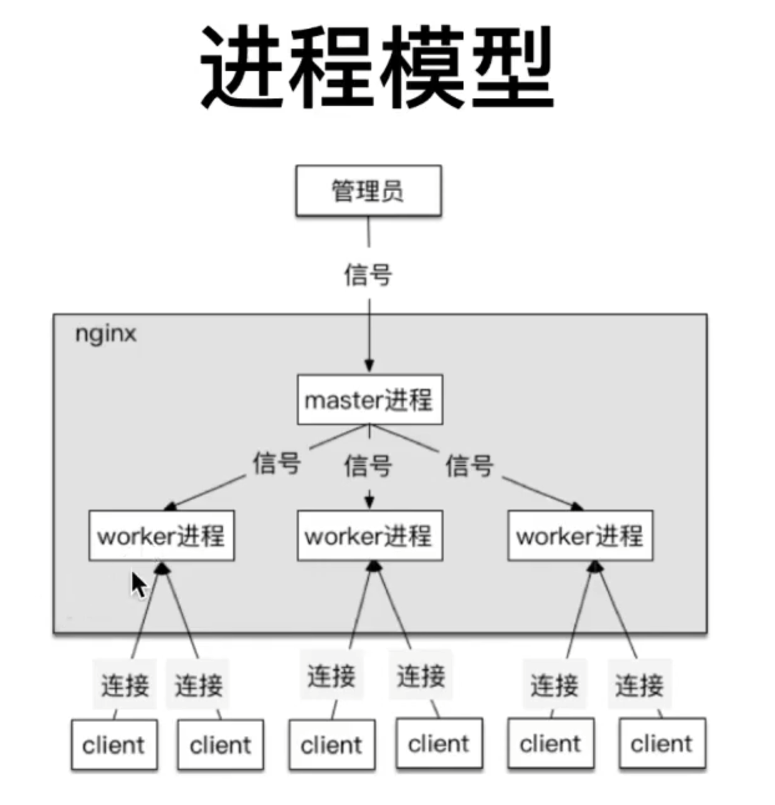
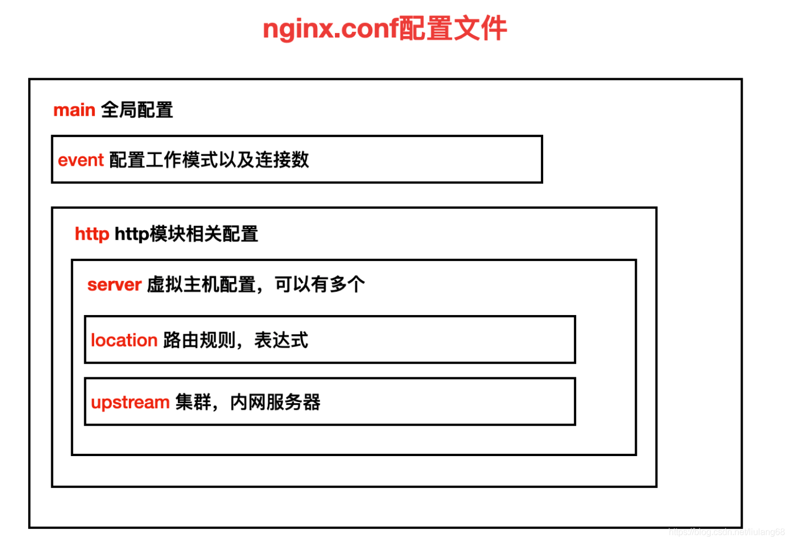

# Nginx的相关文档

## Nginx安装配置

1. 更新apt包
```
sudo apt-get update
```
2. 安装nginx
```
sudo apt install nginx
```

### 在安装过程中报错
::: warning
报错信息：

bacula-console-qt

E: Sub-process /usr/bin/dpkg returned an error code (1) 

处理方式见：

https://apttutorials.com/how-to-fix-e-sub-process-usr-bin-dpkg-returned-an-error-code-1/
:::

## 检查nginx服务是否启动
```
systemctl status nginx
```

如果显示以下状态（有绿色状态显示），则表示服务成功启动


## 检查Nginx配置是否正确
```
nginx -t
```

## 访问公网IP查看Nginx是否挂载了静态页面
Nginx成功挂载后显示界面


### 未成功部署
::: warning
检查云服务器是否开放了80端口，因为Nginx默认使用80端口进行部署
:::

## 设置Nginx服务自动开启
当重启云服务器时，默认不会开启Nginx服务，可以设置其自动开启
```
systemctl enable nginx
```

## Nginx的启动和关闭

### Nginx手动关闭（强制性）
```
nginx -s stop
```

### Nginx的手动开启
```
systemctl start nginx
```

### 优雅的关闭Nginx（所有WorkerProcess工作完成后关闭）-- 建议方式
```
nginx -s quit
```

### 强制关闭Nginx
先看nginx的master process的pid是多少
```
ps -ef | grep nginx
```
通过kill杀死这个nginx的process
```
kill -9 <pid>
```

### Nginx配置重载（修改配置后敲一遍）
```
nginx -s reload
```

## Nginx进程模型
默认情况下，Nginx有2个Worker进程，均有Master主进程来控制，详细如下图



所有主要的通信工作实际都是由Worker进程来控制

## Nginx配置文件的整体结构
Nginx配置文件，如果使用`ubuntu`发行版，且通过`apt install`方式安装，那么其配置文件路径
在：`/etc/nginx/nginx.conf`
Nginx配置文件的整体结构如下


### Nginx配置文件详解
```
# 全局模块配置
## 配置用户权限和组
user www-data;
## 配置worker进程的创建数量，auto表示和CPU内核相关，有几个内核，就会开启几个进程
worker_processes auto;
## 配置全局的错误日志，这里表示三种级别的日志都将被记录到/var/log/nginx/error.log这个文件中
error_log /var/log/nginx/error.log info;
error_log /var/log/nginx/error.log debug;
error_log /var/log/nginx/error.log error;
## 配置nginx启动时的pid信息存放位置
pid /var/run/nginx.pid;
## 每一个Nginx进程打开文件的最大数目限制（Linux中一切皆文件）
worker_rlimit_nofile 65535;
## 引入nginx默认conf
include /etc/nginx/modules-enabled/*.conf;

# events模块配置
events {
    ## 网络IO模型的选用
    use epoll;
    ## 单个进程的最大连接数
    worker_connections 1024;
}

# http模块配置
http {
    ## Nginx默认引用（尚不知用途）
    include /etc/nginx/mime.types;
    default_type application/octet-stream;
    ssl_protocols TLSv1 TLSv1.1 TLSv1.2 TLSv1.3; # Dropping SSLv3, ref: POODLE
    ssl_prefer_server_ciphers on;

    ## 成功日志
    access_log /var/log/nginx/access.log;

    ## 将其他配置分到其他conf文件以减少主conf的复杂度
    include /etc/nginx/conf.d/http/*.conf;

    ## 请求头的配置
    ### 读取请求http中header的值，设定其缓冲区的大小，如超过，则应用large配置的buffer
    client_header_buffer_size 1k;
    ### 如果请求中header值过大，超过上述1k设定，则会应用下述buffer
    ### 如果请求header值也超过large，则直接返回400Error
    large_client_header_buffers 2 21k;

    ## 请求体的配置
    ### 读取请求http中body的值，限制其buffer大小为16k，如超过其buffer大小，则会被写入临时文件
    client_body_buffer_size 16k;
    ### 允许的请求体中大小的限制，如超过设定则返回413Error
    client_max_body_size 8m;

    ## Nginx提高性能配置-1（以下三个配套使用）
    ### 开启高效文件传输模式（是否调用sendfile函数来输出文件，能提高静态资源的托管效率）
    sendfile on;
    ### 配置详细：https://imququ.com/post/my-nginx-conf-for-wpo.html
    tcp_nopush on;
    ### 配置详细：https://imququ.com/post/my-nginx-conf-for-wpo.html
    tcp_nodelay on;

    ## Nginx提高性能配置-2（gzip压缩）
    ### 开启gzip
    gzip on;
    ### 启用gzip压缩的最小文件，小于设置值的文件将不会压缩
    gzip_min_length 1k;
    ### gzip 压缩级别，1-9，数字越大压缩的越好，也越占用CPU时间，后面会有详细说明
    gzip_comp_level 1;
    ### 进行压缩的文件类型。javascript有多种形式。其中的值可以在 mime.types 文件中找到。
    gzip_types text/plain application/javascript application/x-javascript text/css application/xml text/javascript application/x-httpd-php image/jpeg image/gif image/png application/vnd.ms-fontobject font/ttf font/opentype font/x-woff image/svg+xml;
    ### 是否在http header中添加Vary: Accept-Encoding，建议开启
    gzip_vary on;
    ### 禁用IE 6 gzip
    gzip_disable "MSIE [1-6]\.";
    ### 设置压缩所需要的缓冲区大小
    gzip_buffers 32 4k;
    ### 设置gzip压缩针对的HTTP协议版本，没做负载的可以不用
    ### gzip_http_version 1.0;

    ## 与客户端的长连接的配置
    ### 一个长连接最大的请求数量限制
    keepalive_requests 100000;
    ### 代表连接的空闲时间（单位s）
    keepalive_timeout 120;

    # server模块配置
    server {
        ## 服务端口和域名配置
        ### 服务监听的端口，80是http默认端口
        listen 80;
        ### 请求域名
        server_name localhost;

        ## 处理路由
        location ~* ^.+\.(ico|gif|jpg|jpeg|png)$ {
                access_log   off;
                expires      2d;
        }
        location ~* ^.+\.(css|js|txt|xml|swf|wav)$ {
                access_log   off;
                expires      24h;
        }
        location ~* ^.+\.(html|htm)$ {
                expires      1h;
        }
        location ~* ^.+\.(eot|ttf|otf|woff|svg)$ {
                access_log   off;
                expires max;
        }

        ## 引入server配置
        include /etc/nginx/conf.d/server/*.conf;
    }
}

```

## Nginx防盗链
### 什么是盗链？
盗链是说服务提供商自己不提供服务的内容，通过技术手段绕过其他有利益的最终用户界面（如广告），直接在自己的网站上
向最终用户提供其他服务提供商的服务内容（既使用其他服务提供商的流量提供给自己的客户），骗取最终用户的浏览和点击率。受益者不提供资源（或提供很少的资源），而真正的服务提供商却得不到任何的收益。

### 防盗链实现
利用请求头中的`referer`字段，来判断请求源是否处于白名单中，从而决定是否响应资源
进入`/etc/nginx/conf.d`目录下，新建一个任意名称的以`.conf`结尾的配置文件
```
cd /etc/nginx/conf.d && touch turing.conf
```
写入以下配置来实现防盗链
```
server {
    # 监听80端口
    listen 80;
    # 服务名为本地
    server_name localhost;

    # 匹配任意路由下所有的图片静态资源
    # valid_referers后面的referer列表进行匹配，如果匹配到了就invalid_referer字段值为0 否则设置该值为1
    location ~ .*\.(gif|jpg|png|swf|flv|jpeg|bmp)$ {
        # 结尾是白名单
        valid_referers none blocked *.13sai.com;
        if ($invalid_referer) {
            rewrite ^/ http://43.139.15.62:80;
        }
    }

    # 匹配规则是/根目录
    location / {
        # 匹配成功，返回opt下test下的index.html
        root /opt/test;
        index index.html;
    }

    # 反向代理
    location /app/ {
        proxy_pass http://127.0.0.1:81;
        proxy_set_header Host $host;
        proxy_set_header X-Real-IP $remote_addr;
        proxy_set_header X-Forwarded-FOR $proxy_add_x_forwarded_for;
    }
}
```

## Nginx-server模块的location路径匹配优先级

### location字符含义
- `~` 正则匹配，区分大小写

- `~*` 正则匹配，不区分大小写

- `~^` 普通字符匹配

- `^~` 普通字符匹配，搜索停止

- `=` 精确匹配

- ` `默认匹配（不带任何字符）

### 优先级
