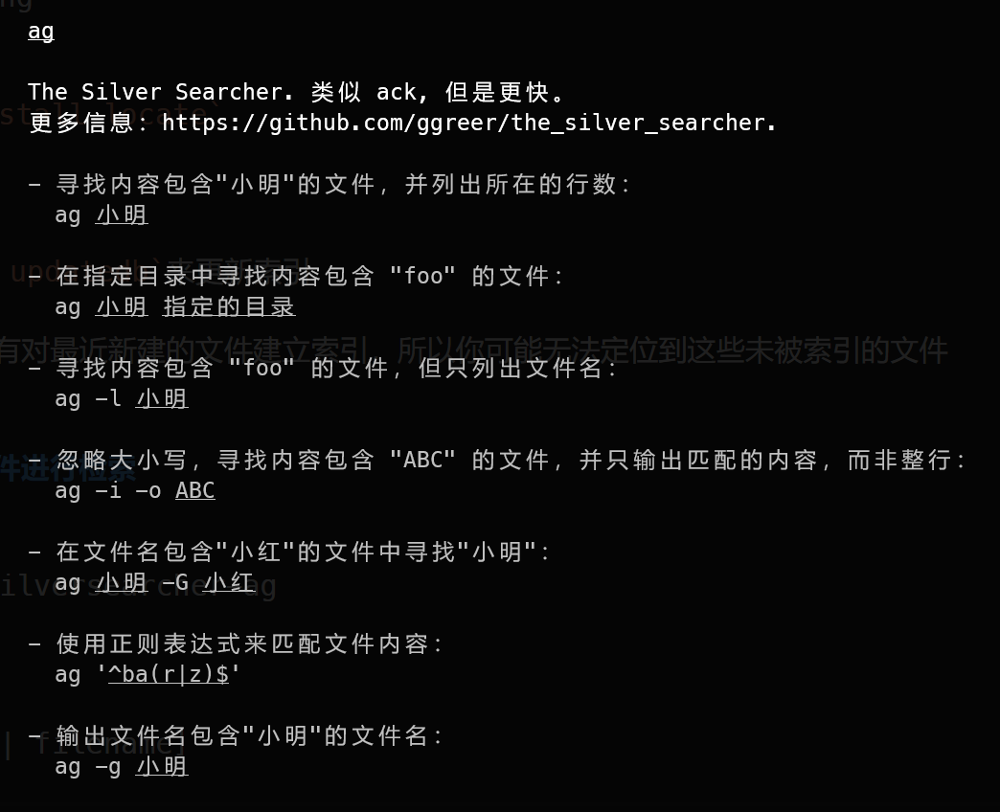

# Linux Ubuntu发行版中的一些基本命令记录

## 优雅的查看进程树
```bash
pstree -p
```
查看经过筛选的进程树
```bash
pstree -p | grep [process name]
```

## 给进程发送信号（中断或其他信号）
### 中断信号
```bash
kill -STOP [pid]
```

## 查看哪些进程在监听端口
```bash
netstat -lntp
```
::: tip
默认是检查 TCP 端口; 添加参数 -u 则检查 UDP 端口
:::
或使用这种方式查看
```bash
lsof -iTCP -sTCP:LISTEN -P -n
```

## 创建常用命令的快捷形式
使用 alias 来创建常用命令的快捷形式。例如： 
```bash
alias ll='ls -Ail'
```
创建了一个新的命令别名 ll

### 使其长期生效
可以把别名、shell 选项和常用函数保存在 ~/.bashrc，这可以使它长期生效，而不会因重登之类的而失去效果
输入：`vim ~/.bashrc`，然后在其末尾编辑别名即可
```bash
...

alias ll='ls -Ail'
```
然后输入：`source ~/.bashrc`，来更新配置

## 交互式的grep利器
percol 是终端中的 交互式 grep 工具


install
```bash
sudo apt install percol
```
例如，指定重定向
```bash
ps aux | percol
```
当你通过交互式的grep筛选出结果后，并回车即可将结果输出到标准输出

## 查看服务器资源占用情况
```bash
htop
```

## 查找文件夹或文件
### 在当前目录下查找一个文件夹或文件
```bash
find . -iname 'something'
```
### 在所有路径下查找
需要先安装：`sudo apt install locate`
```bash
locate something
```
没有效果可以敲一遍：`sudo updatedb`来更新索引
::: warning
但注意到 updatedb 可能没有对最近新建的文件建立索引，所以你可能无法定位到这些未被索引的文件
:::

## 使用ag在源代码或数据文件中进行检索
安装
```bash
sudo apt-get install silversearcher-ag
```
使用
```bash
ag content target
```
具体使用介绍：


## 使用rsync来远程同步文件或目录
rsync 除了支持本地两个目录之间的同步，也支持远程同步，远程同步正是它的亮点所在
它同时可以将本地内容，同步到远程服务器；也可将远程服务器内容，同步到本地
安装
```bash
sudo apt-get install rsync
```
使用
```bash
rsync -avz --progress source/ username@remote_host:destination
```
::: tip
`source`目录表示源目录，`destination`表示目标目录。
:::
也可以将远程内容同步到本地。
```bash
rsync -avz --progress username@remote_host:source/ destination
```

### Windows环境下使用rsync
Windows环境安装rsync（前提有装scoop，scoop安装：https://scoop.sh）
```powershell
scoop install cwrsync
```
#### Example1：从远程服务器指定目录的所有内容同步到当前指定目录中
::: warning
注意三个点：

1. 以下的sundo是我的电脑用户名，把他改成你的用户名以确保他能够正确找到

2. 把cwrsync后目录的版本6.2.7改成你下的版本以确保指向正确

3. 把root后的ip地址改成你的以确保ip正确
:::
```powershell
rsync -avz --progress -e 'C:/Users/sundo/scoop/apps/cwrsync/6.2.7/bin/ssh -p 22' root@xxx.xxx.xxx.xxx:/opt/web/website ./website
```
::: warning
指定-e参数并且指向具体的ssh是为了避免windows有两个ssh.exe导致的问题，详细见：

https://blog.csdn.net/xy707707/article/details/107560582
:::

#### Example2：从本地目录将指定内容同步到远程服务器指定目录中
结果：将本地当前目录下的test目录中所有内容同步到远程服务器的/opt/test目录下
```powershell
rsync -avz --progress -e 'C:/Users/sundo/scoop/apps/cwrsync/6.2.7/bin/ssh -p 22' ./test/ root@XXX.XXX.XXX.XXX:/opt/test
```
