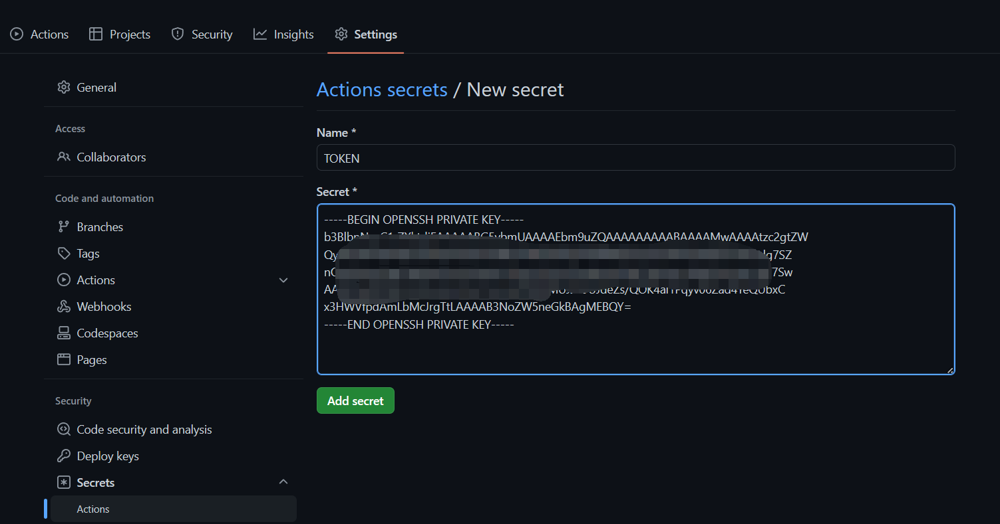
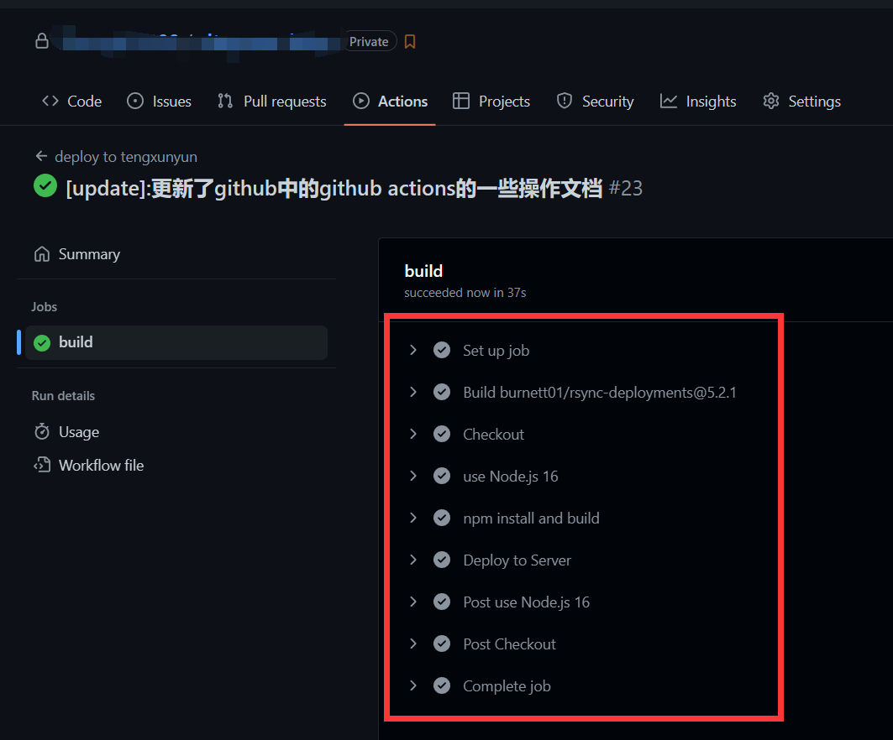

# Hello Github

## Github Actions
Github Actions能够替代`jenkins`来实现CI/CD的工作
通常来讲，对于小型的服务器，如果要跑一个`jenkins`服务，其消耗的系统资源是比较大的
所以我们可以利用Github Actions的功能来实现自动化部署

## 基本原理
Github Actions相当于为我们提供了一个我们指定的环境如linux环境，然后在他那里我们可以去安装服务所需的一些包
例如`Nodejs`环境。我们有了nodejs环境之后，便可以通过`npm`的安装和打包。之后我们又可使用`rsync`来
通过ssh远程登陆我们的CVM，让他把打包好的静态网站部署到我们的nginx上面，便完成了CI（持续集成）的工作。

## 详细步骤

### 1. 在项目根目录下初始化自动部署的yml配置
项目根目录下新建如下结构
`.github/workflows/blank.yml`
并在blank.yml的配置中写入以下内容
```yaml
# 一个workflow，名为Deploy To CVM
name: Deploy To CVM

on: # 此CI/CD触发时的事件
  push: # 在代码提交时自动触发
    branches:
      - main
      workflow_dispatch: # 允许手动触发事件
# 一个 CI/CD 的工作流有许多 jobs 组成，比如最典型的 job 是 lint，test，build。
jobs:
  build: # 构建job
    runs-on: ubuntu-latest # 跑workflow的服务器系统
    steps: # job的一系列动作
      # 切换分支获取源码
      - name: Checkout # step的名称，将会在 github action 的控制台中显示
        # 选择一个action，可以理解为若干 steps.run，有利于代码复用
        uses: actions/checkout@v3
      # 安装使用 node:16
      - name: use Node.js 16
        uses: actions/setup-node@master
        with:
          node-version: 16
      # 运行命令，npm install && npm run build来构建我们的项目
      - name: npm install and build
        run: |
          npm install
          npm run build
        env:
          CI: true
      # 部署到远程CVM服务器
      - name: Deploy to Server
        uses: burnett01/rsync-deployments@5.2.1
        with:
            # rsync的参数配置
            switches: -avzr --delete
            # path是将哪些文件部署过去，通常这根据不同项目构建项目时存放位置的不同而决定
            path: dist/
            # remote_path是将build好的源码放目标云服务器的哪个目录下，通常nginx默认部署的文件目录就在/var/www/html/
            remote_path: /var/www/html/
            # HOST是要部署到的远程云服务器的公网ip
            remote_host: ${{ secrets.HOST }}
            # USER是远程登陆时所使用的用户，如root。定义在secrets是为了安全，不将隐私内容暴露在配置中
            remote_user: ${{ secrets.USER }}
            # 本地.ssh文件下的私钥id_rsa，存在secrets的TOKEN中
            remote_key: ${{ secrets.TOKEN }}


```
### 2. 在本地生成ssh并将公钥配置到云服务器上
本机上使用命令`ssh-keygen -t ed25519 -C "token"`来生成token

再输入`cat ~/.ssh/id_ed25519.pub`来查看是否生成成功

生成之后，将该`id_ed25519.pub`公钥内的所有内容复制然后粘贴到云服务器的ssh
```bash
vim ~/.ssh/authorized_keys
```
按`i`进入编辑模式，在最后一行粘贴，然后按ESC，输入`:wq`保存并退出

### 3. 将私钥配置到repo的secrets中（secrets在settings栏）
在本机上`cd ~/.ssh`，并复制目录下`id_ed25519`文件中所有内容（注意别漏掉尾部的换行）
然后进入secrets中

点击New repository secret新建secret，并将标题取为：`TOKEN`，将复制的私钥内容粘贴到文本框内（不要把尾部换行删了）


### 4. 继续配置secrets，配置HOST和USER（云服务器的公网IP和登陆用户）


## 回到刚刚第1步所创建的`blank.yml`配置文件
其中有部分配置是要做修改的：
1. 需要将安装命令和打包命令（`npm install` 和 `npm run build` 这一步）的命令换成你的项目所使用的安装和打包命令，以免出错
2. 部署到远程CVM服务器这一步，我们需要做两个更改：
- `path` 的值需要改成你的项目中构建出来的目录位置
- `remote_path` 的值需要改成部署到的云服务器目录位置，通常nginx的静态网页默认部署在 `/var/www/html` 文件夹中

## 在本地通过git push来提交代码并让github action自动部署到云服务器
如果完成了以上所有步骤，便可以将代码提交到repo，默认是会触发push事件，所以在提交后，actions便会运作

如果配置成功，且没有出现任何问题，actions便会成功运行
